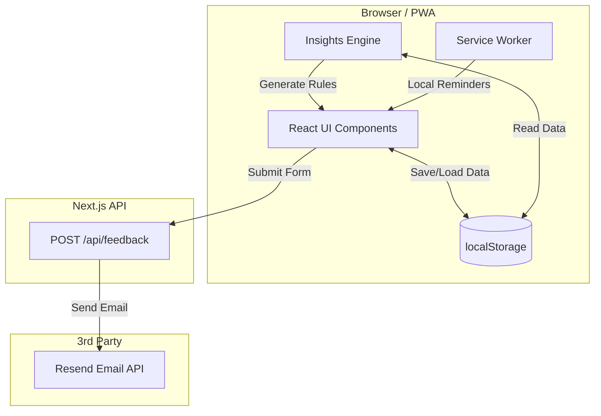

# Himmah همة
**Small actions. Steady deen.**

Himmah is a private, offline-first Progressive Web App (PWA) designed to help Muslims build consistency in their daily spiritual habits without guilt, surveillance, or accounts.

## Core Philosophy

- **Private**: No account, no sign-in, no cloud database for tracking. All your daily entries, reflections, and skip reasons stay securely in your device's local storage.
- **Simple**: Tracking takes seconds. 
- **Honest**: Distinguishes between Done, Late, Missed, and Not Tracked.
- **Growth**: The gamification mechanic is "Rhythm" (active days out of 7), not strict punishment-based streaks. A bad day doesn't erase your progress.

## Architecture

Himmah operates almost entirely on the client side, using `localStorage` for data persistence. The only backend functionality is an anonymous feedback route using Resend.



## Tech Stack
- Next.js 14 App Router
- Tailwind CSS
- React (Local State / localStorage)
- PWA (next-pwa / generic service worker)
- Resend (for anonymous feedback emails)

## Installation & Running Locally

1. Install dependencies:
```bash
npm install
```

2. Environment Variables:
Copy `.env.example` to `.env.local` and add your Resend API key and receiving email.
```bash
RESEND_API_KEY=re_your_api_key_here
FEEDBACK_EMAIL=your@email.com
```

3. Run the development server:
```bash
npm run dev
```

4. Open [http://localhost:3000](http://localhost:3000)
